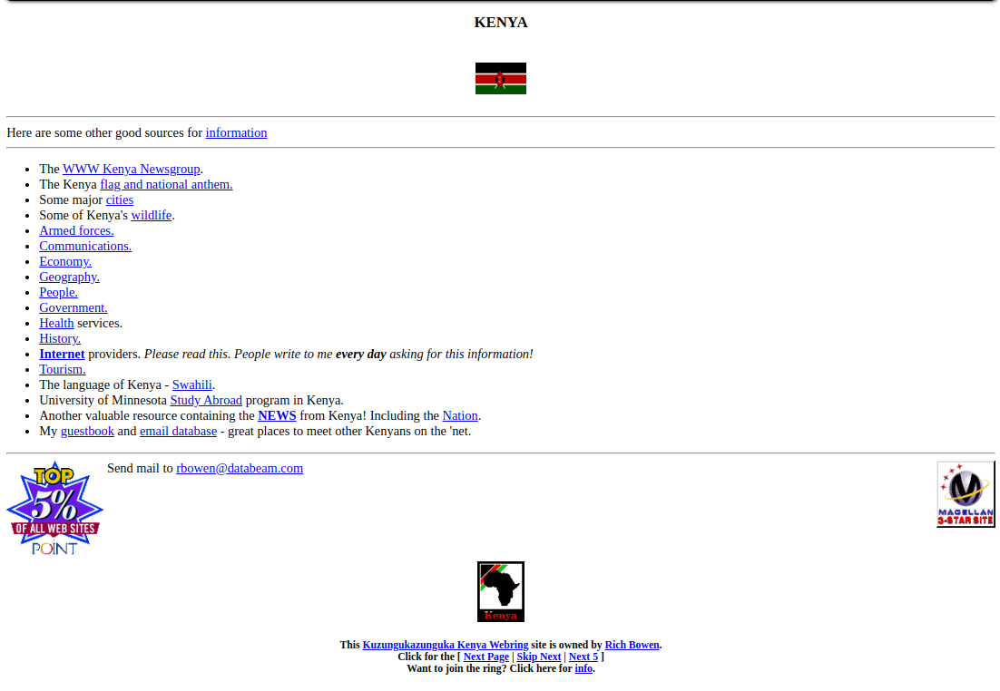
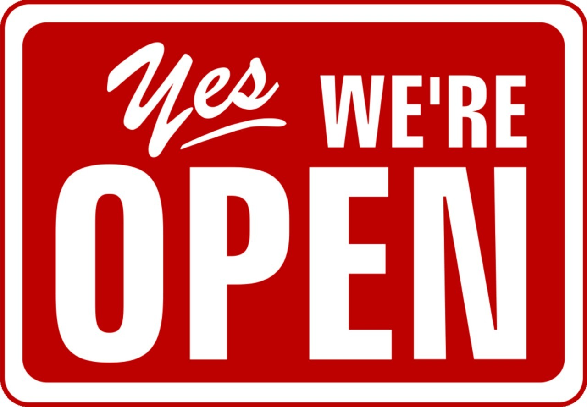
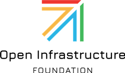

class: center, middle
## The Apache Way

#### *Doing Community like Apache*

Rich Bowen

Director, The Apache Software foundation

---
## The Apache Way

???
I'm here to talk about the Apache Way of software development, and why I
believe it's (one of?) the best way to develop software.

---
## What is the Apache way?

* Community of Peers (Level playing field)
* Earned Authority (Merit)
* Transparency
* Consensus
* Self-governed projects, with oversight

???
The Apache Way is notoriously hard to define, because it's more culture
than a rule book. But these are some of the most important components
that are consistent across most interpretations.

---

???
Most of the philosophy comes directly out of the history. Many of our
processes/policies are actually scars from past mistakes.

---
## A Brief History

* 1994 - NCSA httpd development stalled
    * Brian Behlendorf and The Apache Group
    * First release of Apache httpd in December 1994
* 1998 - The Apache Software Foundation established, to provide a legal framework
* Today: 300+ projects

???
From the very beginning, vendor neutrality was a big motivation,
because of NCSA httpd disappearing once people had already built their
businesses around it. Brian wanted to ensure that he would never again
have his business held hostage to the shifting plans of another
organization in which he had no input.

---

---

???
I started in open source the way that many of us do - to solve a
problem. RCBowen Kenya Site, circa 1993

---
## Community of Peers
* Vendor neutrality
* Individuals, not organizations
* Every voice is equal

???
Of course, reality and philosophy seldom match up exactly. And that's
why projects have foundation-level oversight.

The Board, and the membership, is tasked with oversight to ensure that
these principles are actually practiced, since the natural progression
of things leads to them being ignored.

---
## Community > Code

* The community sustains the code
* The code motivates the community
* Community building is hard work

???
An open source project without a community is just a personal hobby that
you happen to do in public. More about this later under "Four Opens"

If you build it ...

---
## Earned Authority
* Project leadership is granted to people who do the work
* Each project defines this a little differently

???
This is sometimes called Meritocracy, although that word has other 
connotations and is falling out of favor.

---
## Self-governed projects
* Board oversight ...
* But each project determines their own local culture and rules
* What does "governance" mean? It's just writing down who makes the
  decisions, and how, and the path to becoming one of those people.

---
## Progression of responsibilities

???

We like diagrams like this, but the truth tends to be a little messier.

---

## Users and Contributors

* Use it, so that we know it works in a variety of situations
* Complain about what's broken, so we can fix it
* Occasionally contribute their own fixes/changes

???

* Users are a critical part of any open source project. Without the
  users, it's all just a toy. The users give us insight into how things
  are used, and what improvements need to be made. And they help us push
  the project into new areas that we wouldn't think of without them.
* Contributing a change to a project can be scary, and expose yourself
  to the judgement of others. It's a BIG step from user to contributor.

---

## Committers

* Have the *technical* right to make changes directly to the source
* The *social* process to actually make those changes will vary from one
  project to another.
* Setting the barrier too high can result in a project losing momentum
  and eventually dying.

???

* Some users become contributors, and, eventually, they are made
  Committers, granting them the right to make changes directly to the
  code. Apache projects have a process for reviewing and accepting those
  changes - it's not just a free-for-all. So there's relatively little
  risk in making someone a committer.
* Weigh the risk of granting committer rights against the risk of *not*
  granting these rights and losing a passionate contributor.

---

## Project Management Committee

* The PMC is (usually) a subset of the committers, who can:
    * Add new committers and PMC members
    * Vote on a release
    * Report to the Board (Chair role)

---
## Technical decisions

* Made by consensus. Votes happen only when consensus cannot be
  achieved. Most decisions are "lazy" consensus
* Vetoes must be on technical grounds, and have a respectful
  path to resolution
* PMC votes are binding

---
## PMC Chair

* No special authority in the project. Not the technical lead
* Responsible for quarterly report to the Board.

---

## PMC reporting

* Quarterly reports covering project health and progress
* The Board is more concerned about health than technical issues

---

## Members

* Usually are involved in one or more projects
* Selected by the existing members
* Can
    * Vote to add new members
    * Vote for the Board

---

## Board

* The boring stuff ...
    * Ensures the bills are paid
    * Ensures we're not breaking the law
    * Most of this stuff is delegated to officers and the President
    * Enforce, and occasionally update, the bylaws

---

## Board, cont'd

* Project oversight
    * Ensures that projects are behaving in ways likely to lead to success
    * The Board does *not* give any technical guidance

---

## Board, cont'd

* Board membership is a *VOLUNTEER* position
* Foundation sponsorship does *not* grant a voice on the board
* Projects, and the Foundation, are influenced by participation, not by
  money

---
## Transparency
* The "Open" in "Open Source" is not just about the source being visible
* Public communication ensures that anyone can participate

???

* Public/Archived mailing lists ensures that we can discover past decisions, and the reasons for them, forever
* Surprise is the opposite of engagement: public communication about the road map ensures that the community is never surprised
* Can slow the speed of development, but ensures that participants in all time zones, all languages, can participate as equals.
* Shift to synchronous communication mediums - e.g. Slack - threaten this openness.

---
## Consensus
* Decisions are made by the entire community
* Votes are only necessary when we cannot achieve consensus

---
## Open is more than just a list of rules

---
## The Four Opens
* Open Source
* Open Design
* Open Development
* Open Community

<small>openinfra.dev/four-opens/</small>

???
A bit of a sidebar ... but ... 

* Open Source is a legal definition - an OSI-approved license
* Open Design means planning in public, with public input
* Open Development means all code changes happen in public
* Open Community refers to governance models that clearly document a path to leadership, regardless of what organization you're part of, based on your demonstrated leadership

---
## Open Source

* Defined by the OSI - Open Source Initiative
* "Open" or "Free" licenses are generally understood to adhere to the
  "four freedoms"

---
## Four Freedoms

A program is “free software” if the program’s users have the four essential freedoms:

0. The freedom to run the program as you wish, for any purpose.
1. The freedom to study how the program works
2. The freedom to redistribute copies
3. The freedom to distribute copies of your modified versions to others

<small>Richard Stallman - gnu.org/philosophy</small>

---

## Apache Software License v2

???
* The Apache License is a so-called "permissive" license, because it allows you to do (almost) anything with the code, as long as you give credit for where you got it.
* Certain other licenses put more (or less) restrictions on what you can
  (or must) do with the software

---
## Running your project the Apache Way

So ... what if you want to run your project this way?

* Radical transparency - Default to open
* Document the path to leadership
* Evaluate contributions based on the contributions, not based on the contributor
* Delegate everything to the people willing to do the work, and then TRUST them to do it.

???

* What if you want to run your own project this way?
* Radical transparency means *all* conversations have to be in public.
  That is a significant change to team dynamics. Make sure you're ready
  for that

---
## Transparency

* Conversations where everyone can see them, both now, and in the future
* Allow anyone to speak up, but set expectations around who actually
  makes the decisions. (Everyone is heard DOES NOT mean that every
  suggestion is acted on.)
* Be aware that listening to everyone takes a LOT of time

---
## Define your governance

* Document who makes the decisions
* Document the path to leadership

<small>https://github.com/github/MVG</small>

---
## Level playing field

* Contributions evaluated on merit

but ...

* Clearly document the criteria by which this evaluation is done (Coding
  standards, testing framework, etc.)

---
## Delegate and trust

* Welcome new contributors, and let them make mistakes
* Succession planning is a way to make yourself immortal
* Mentoring is one of the most rewarding things you can ever do in your
  career

???

Licked cookies

---
* Q&A

    rbowen@apache.org

    @rbowen

    <small>github.com/rbowen/presentations/droidcon_keynote</small>

