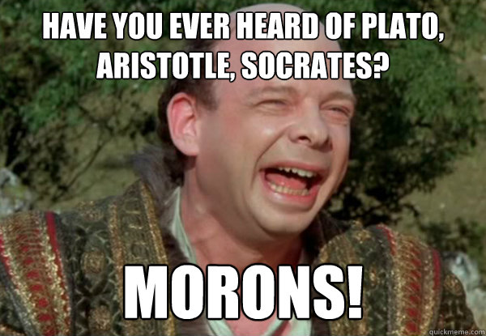
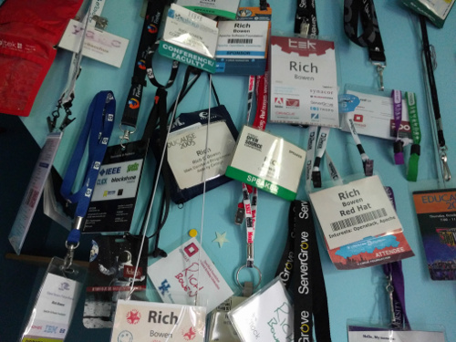
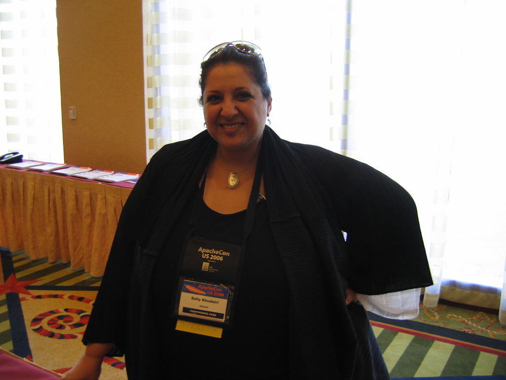
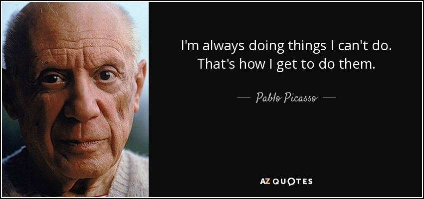
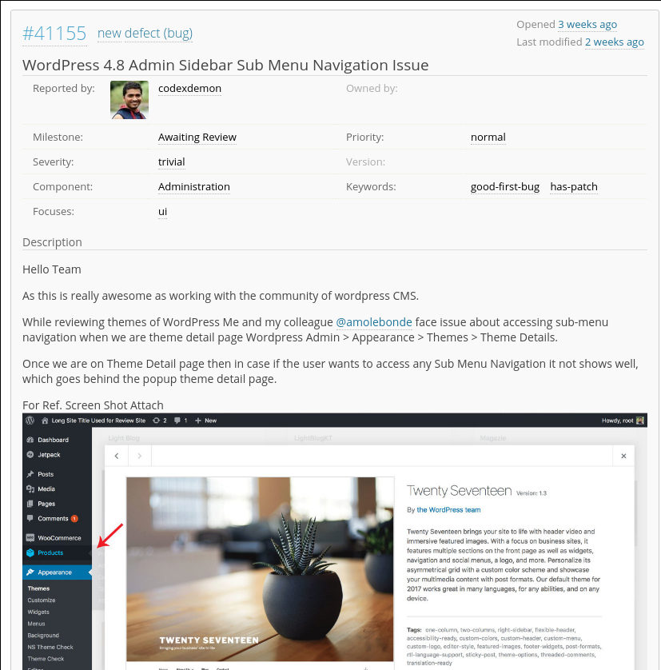
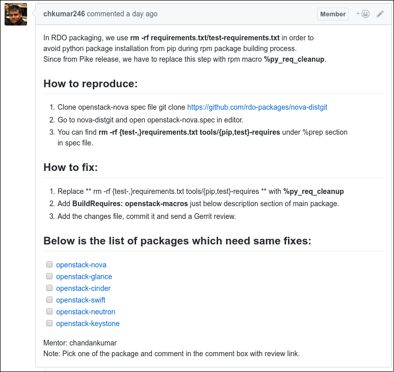
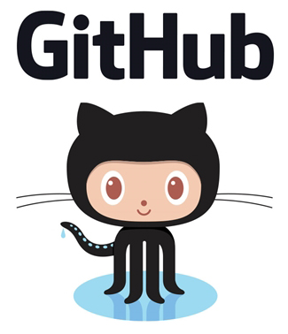

class: center, middle
# Mentoring: Your Path To Immortality

Rich Bowen, (Apache|Red Hat)

Slides: BoxOfClue.com/mentoring

???

There are many motivations for writing open source software. A desire to
be remembered is high on many people's list.

* Scratching your own itch
* Fun, socialization
* Make the world a better place, and possibly be remembered for it

---

???
* Socrates
* Is one of the most famous names in history.
* Didn't write anything (at least that we still have). In fact, thought
  that debate, rather than writing things down, was the only valid way
  to do philosophy.

---

???
* By all accounts he was a very unpleasant man (Dear Theo)
* Felt like a failure his whole life
* Is famous only because his sister-in-law hunted down all of his work
  after his death and mounted an aggressive marketing campaign
* Mentored my other favorite painter, his lifelong friend Paul Gauguin.

---

## Echecrates

???
* Appears as an "aid to the plot" in Plato's *Phaedo* (He's the person
  to whom the story is told.)
* I wasn't able to find anything he wrote, or any pictures
* (And then, of course, there's the dozens of others whose names we
  don't even know.)

---

## What did we learn?

* Two paths to immortality:

1) Leave an extensive body of work

2) Leave a student who is even more impressive than yourself

---

## Option 1: Leave extensive work

???
* Sisyphus, by Titian
* Sisyphus was punished for his self-importance, and trying to make a
  name for himself, by having to perform an endless task.
* Punishments in Greek Mythology always exactly match the sin. In this
  case, making a name for yourself is a never ending task. As soon as
  you stop, everyone begins to forget you.

---

## That's hard

* You have to actually **DO** that work
* And you have to pick a medium that is permanent
* Alas, we work in software, which is definitively *not* permanent

---

## Option 2: Leave impressive students

???
Oops, wrong image

---

## Option 2: Leave impressive students

???
* Because Socrates invested his entire life in his disciples, his legacy
survives, and modern philosophy is the shape that it is.
* His students include Plato and Xenophon
* Plato's students include Aristotle

---

## A word of caution ...

???
Alexander the Great was one of Aristotle's students.

Choose your students with caution, or they might destroy the world

---

## So ... how do you do that?

* Practical tips for active mentoring in Open Source

---

## Give permission

* Social
* Technical

---

## Technical permission

* "Commit bit"
* File permissions, or root, on your servers

---

???
* Ensure you have a rollback plan
* hand out rights like candy

---

## Why do we not hand out commit rights?

<small>Image: Creative commons, goodnet.org</small>

---

## They're not trusted yet

* How will they become trusted if we don't give them space to make
mistakes?
* Withholding trust is a great way to ensure that they don't stick around
to earn trust.

---

## They might break something

<small>Photo Credit: <a href="https://www.flickr.com/photos/22958748@N06/2403430622/">Dieter Drescher</a> Flickr <a href="https://creativecommons.org/licenses/by-nc-nd/2.0/">cc</a>

???
* That's why you have revision control, right?
* Revert their change, but then actively engage with them to get them to
  a point where you can accept their change.

---

## But, but ... they might break something!

Some things are much more expensive when they get broken

* If it's infrastructure, let them work on dev/test first
* If it's code, let them work in a branch first

---

## RTC vs CTR

* Review, then commit
* Commit, then review

Sometimes it makes sense to have different policies for your release
branch vs your development branch, for example.

---

## CI and commit hooks

* Every change goes through testing, so that rejected commits come with
  a detailed report of *why* it's rejected
* Ensure that someone is watching, and can help someone turn failure
  into success.

<small>
Photo Credit: <a href="https://www.flickr.com/photos/95285095@N02/8690237450/">Mariana Montes de Oca</a> Flickr <a href="https://creativecommons.org/licenses/by/2.0/">cc</a></small>

---

## Social permission

* This is a lot harder
* Give people *social* permission to participate
* There's many ways that we forbid people to participate

---

## Give time to participate

When you see a bug, don't fix it immediately unless it's actually urgent

* Log a ticket
* Include a description of how you might fix it
* Talk about the ticket on the mailing list
* Ask if anyone has time to look at it
* Wait a bit

???
If tasks always get done quickly, by the usual suspects, newbies quickly
realize that they have nowhere to fit in, and they go away.

---

## Corporate participation

* Waiting for new contributors to participate can be particularly
  difficult in projects with a large corporate presence
* This is hard, and is becoming more and more common in open source as a
  whole
* I don't know how to fix this. Suggestions welcome.

???
Anecdote: $Project at Apache where a large software company started
participating. The project started moving much faster (good, right?!)
but the volunteer participants quickly felt that $Company had "taken
over" the project. The $company participants felt that they were being
held back. This eventually led to a split in the project.

This is HARD.

---

## Ask people to do things

Directly asking someone to work on something serves a number of purposes

---

## It lets them know that they're allowed

You might think they already know this. It's open source, after all.

They don't know.

They think that they have to be *someone special* to contribute to your
project.

You need to tell them that they are already someone special.

---

## It lets them know that you think they can do it

Telling someone that you believe they can do it is a very powerful
thing.

It helps them believe it themselves.

---

## It lets them know that they are trusted enough

Telling someone you trust them, and then actually trusting them, is
very, very empowering.

---

## It lets them know that the project is counting on them

Ask them to to it, and then expect that they're going to.

Feeling that someone depends on you is a huge encouragement to move out
of your comfort zone.

---

## It models the behavior that they should then follow for others

---

This is Ken. In 1999 he encourage me to submit a
paper to a conference. At the time, I was pretty sure I had nothing
whatever to say.

---

These are just a few of the events that I've spoken at since then, as a direct
result of Ken asking me. Every wall of my office is covered with these.

---

This is Jim. In 1998 or so, he told me to go fix it myself, rather than
waiting for him to do it.

---

I did. This
resulted in thousands of commits on the httpd docs. That, in turn,
resulted in several books, and most of my jobs since then.

---

This is Sally. In 2006 she encouraged me to get more involved in the
governance of the Apache Software Foundation.

---

Today I'm a director at the ASF. I've served in a number of different
officer positions, and currently am the VP in charge of conferences.

---

<small>Image courtesy of www.askideas.com</small>

???
None of these examples are supposed to show how awesome I am, but,
rather, how these respected members of one particular community
encouraged me to do things that I was confident I was not capable of
doing, and, as a result, changed my life, and made the project more
sustainable.

---

## Do What You Can't

Related: https://youtu.be/jG7dSXcfVqE ("Do What You Can't", by Casey
Neistat and Max Joseph)

---

## How to ask - Be specific

* **Don't** say "come help"
* **Do** say "please do this task", and point to a ticket
* Ask someone to answer a question on the forum/IRC/mailing list, rather
  than just answering it yourself

???

"Micromentoring" - asking people to do one specific task (like answering
a question) instead of doing it yourself. Takes 2 minutes, but conveys
all of the above messages of trust and permission.

---

## How to ask - set expectations

* Set a time expectation
    * Tell them when it needs to be done by
    * Check in midway through the time
* Set code quality expectations
    * Coding standard
    * Test procedure

???

If you don't have these expectations codified, do write down what you
tell them, so that you have it for the next time. This is also a great
way to build out documentation of your development process

Setting standards makes it clear that you think they can live up to
them. It also communicates that this is serious business that you are
trusting to them.

---

## How to ask - Offer to help

* Offer to review whatever they produce
    * Be very specific in your critique
    * Be kind, but don't approve bad work in order to be kind. That's
      not actually being kind.
* Don't interfere or do it for them. Make it clear that you're willing
  to help, but don't butt in.
* Don't be condescending. Assume competence, and help only when needed

???
This has the side effect that they'll come up with new ways of doing
things that wouldn't happen if you "help" too much.

---

## Give credit

* Celebrate first contributions
    * On Twitter
    * In your newsletter
    * In the release notes

OpenStack mentions every contributor to each release of the software.
https://www.openstack.org/software/queens/ lists all 1,925 contributors
by name.

Wordpress does this too: https://wordpress.org/news/2018/05/wordpress-4-9-6-privacy-and-maintenance-release/

---

## Even if you helped ...

* If you mentored a contribution through to a commit, even if you did
  *most of the work*, give the credit to your student.
* Remember that it's not about you

---

## Identify good starter tasks

* Related to earlier point, but more ...
* Actively tag tickets as "easyfix" or "good-first-bug", or similar
* Forbid the regulars to work on them
* Set notifications so you know when someone is working on it

???
It will often take you more time to write up the ticket in this way than
it will to fix it yourself. Remember that it's not about this ticket.
It's about investing in the future of your project, and amplifying
yourself.

---

???

Wordpress

---

???

RDO 

FWIW, I dislike the use of the word "easy" in most contexts. In this
case, however, I think it sets expectations in a reasonable way. ie, if
you find this easy, this is likely a good project for you to be involved
with.

---

???

RDO, detail

---

## Easyfix: Reference

* https://fedoraproject.org/easyfix/
* http://rdoproject.org/easyfix
* https://core.trac.wordpress.org/tickets/good-first-bugs

---

## Clearly document your process

You may think that your project contribution process makes sense

It doesn't

Document the process. Then have someone go through it for the
first time, and write down everything that was assumed, or otherwise not
obvious. Add that to the process documentation. Repeat.

---

## Who should you mentor?

Be carefully who you invest your life in

---

## People who ask good questions

* Encourage them to write up the answers they get and contribute to the
  documentation
* Documentation is the gateway drug to project participation

---

## People who always argue about how things are

* People who complain tend to view themselves as the outsider, and you
  as the cause of their problem
* Welcoming them into the "us" who can fix the problem they're having
  changes the game, and makes them responsible for their own fix

---

## People who are answering questions on other sites

* These people are demonstrating a passion to help others
* Encourage them to come help the whole world

---

## People who are developing plugins/modules/patches for your project

* Finding related projects on Github is a good way to find talent
* Invite them to come join the party
* Plugins, modules, themes, additional documentation, etc, etc

---

## Everyone else

* Be aware that mentoring can be a significant time investment
* Sometimes, the people that you mentor can become lifelong friends
* However ...

???

Next slide: People to avoid

---

## Mentees to avoid

* Some people are just looking for something to pad their resume
* Others are trying to bypass the hard work and get straight to the
  fame and adulation that invariably comes with open source
  contributions. (Or so they imagine.)

???

* No, "mentees" is not a real word. I hate people that use it. Also, 
  it always makes me think of manatees.
---

## "Do my homework" mentoring

* And some are just looking for you to do your job for them
* It can be hard to detect these folks before you've already sunk hours
  of your life into it.

---

## Amplify yourself

* You have only a certain number of hours in your day, and days in your
  life
* Amplify your overall influence on the world by cloning yourself.

???

But be sure you're not just cloning yourself. Seek people that are
different, so that you expand the pool of ideas, and don't just leave a
stagnant pond.

---

## Touch the future

* If you only look out for yourself, your influence ends the day you
  step away from the project.
* Mentoring allows you to have an influence on the future, both of your
  project, and of the individuals involved.

---
class: center,middle
## finis

rbowen@redhat.com

@rbowen

@CentOSProject

@RDOProject

@TheASF

Community.RedHat.com

Slides: BoxOfClue.com

